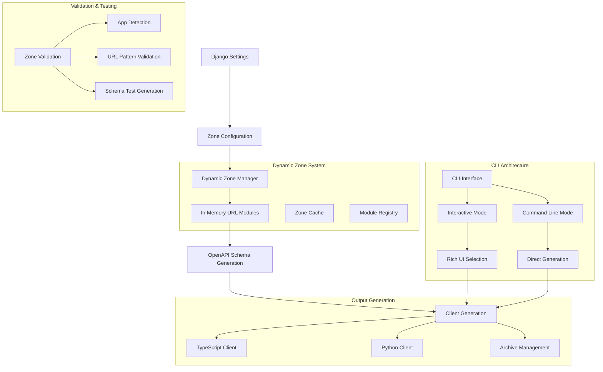
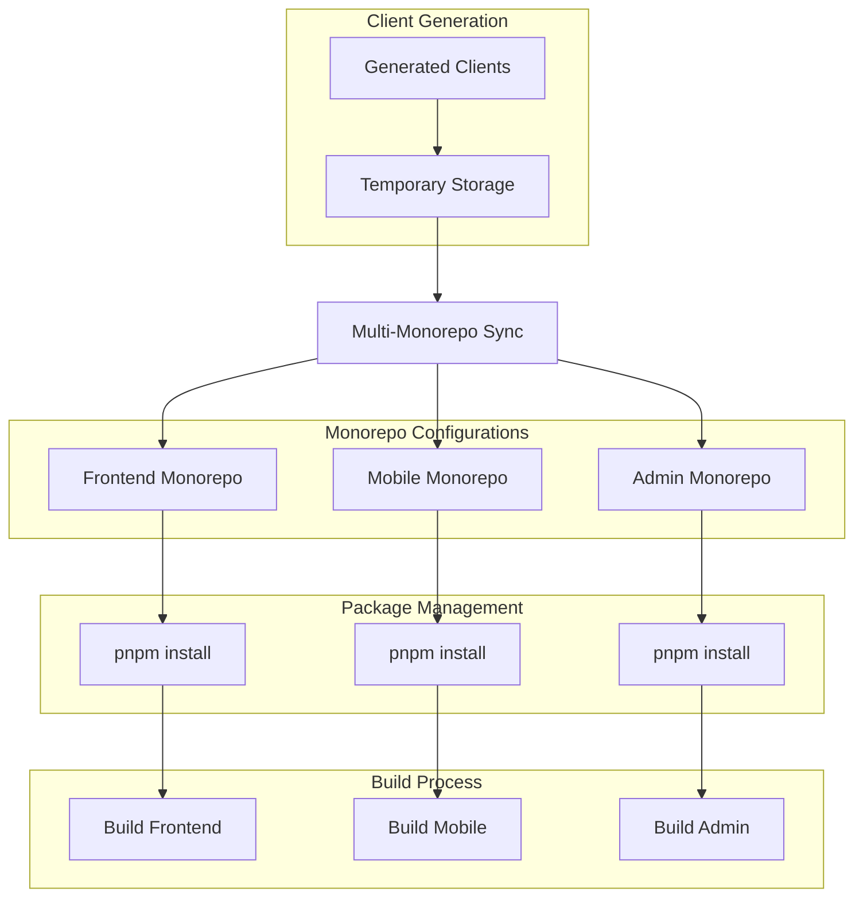
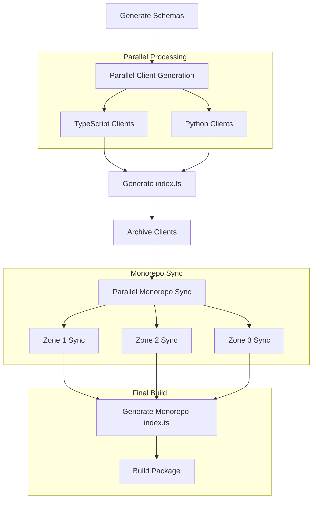
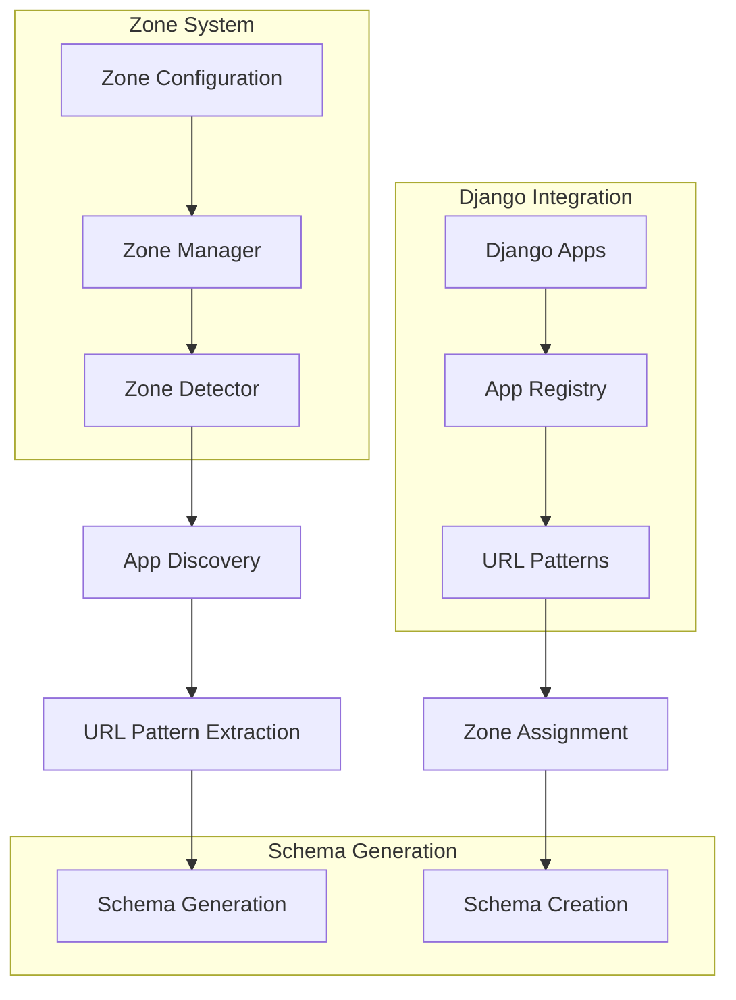
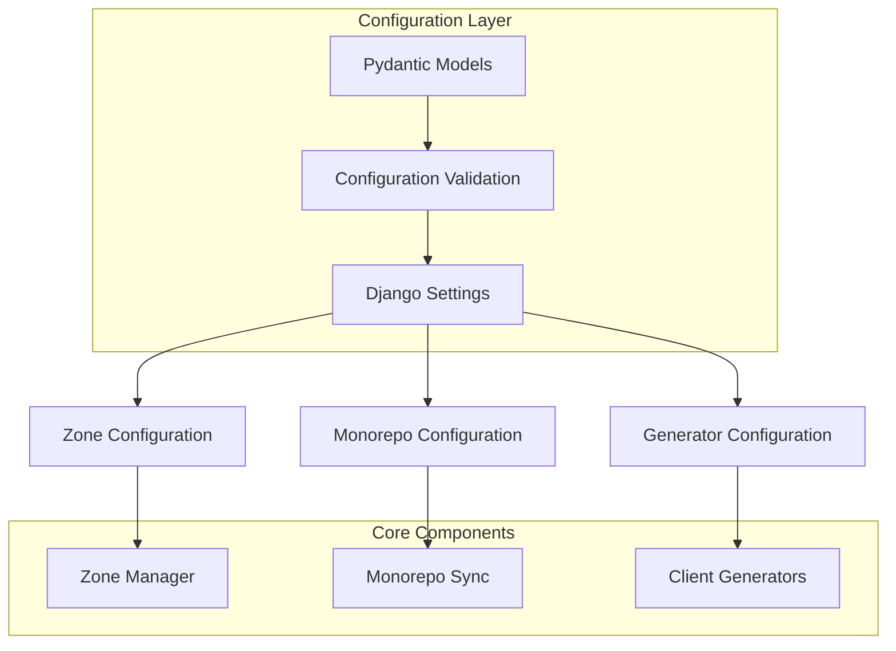
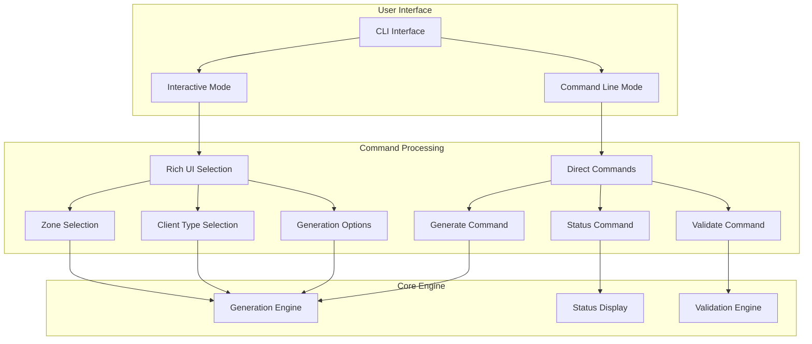
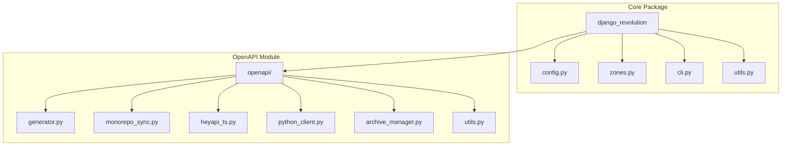
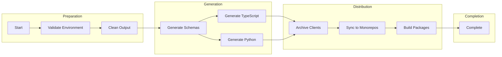
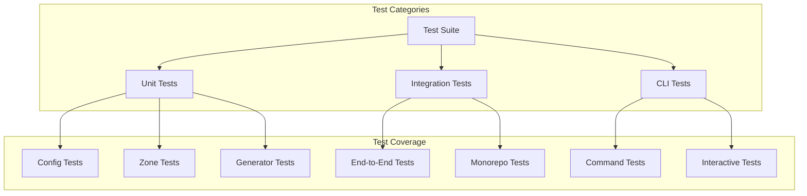
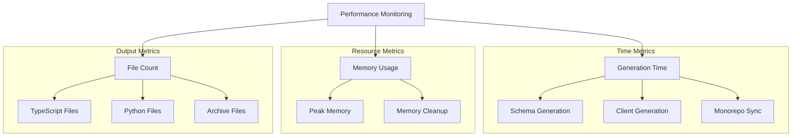

# Django Revolution Architecture

> **System Architecture and Data Flow Diagrams** 🏗️

## 🔄 Data Flow Architecture

## 🏗️ Multi-Monorepo Integration Architecture

## ⚡ Multithreading Architecture

## 🧩 Zone Management Architecture

## 🔧 Configuration Architecture

## 🎯 CLI Architecture

## 📦 Package Structure

## 🔄 Generation Pipeline

## 🧪 Testing Architecture

## 📊 Performance Metrics

---

**Django Revolution Architecture** - Designed for **scalability**, **performance**, and **developer experience**.

> **Key Design Principles:**
> - **Modular Architecture** - Each component is independent and testable
> - **Type Safety** - Full Pydantic validation throughout
> - **Performance First** - Multithreaded generation and caching
> - **Developer Experience** - Rich CLI and comprehensive error handling
> - **Flexibility** - Works with or without monorepo integration 